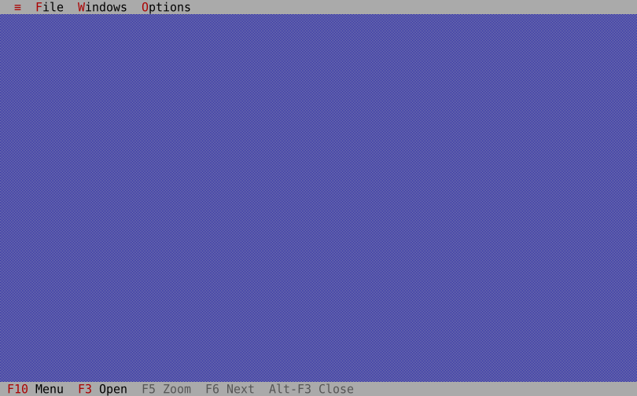

# Demo animation



`tvdemo.webp` is an animated WebP tour of the `tvdemo` example — the menu bar,
the About dialog, the calculator (driven `6 * 7 = 42`), a window drag, and
cascaded windows.

## Regenerating it

```sh
cargo xtask demo
```

This is a fully **owned, deterministic** recorder — no external tool (asciinema,
agg, vhs, ffmpeg) required. It:

1. drives `tvdemo` in a detached **tmux** session (same mechanism as the guide
   screenshots), sending the choreographed keystrokes in `xtask/src/demo.rs`;
2. captures one coloured frame per scene with `tmux capture-pane -e -p -N`;
3. parses the ANSI into a cell grid (`xtask/src/ansi_html.rs::parse_grid`) and
   rasterizes each frame with a bundled DejaVu Sans Mono font
   (`xtask/src/raster.rs`);
4. encodes an animated WebP with the `webp` crate.

Per-scene PNGs are written to `target/demo-frames/` for inspection. To change the
tour (which windows open, button presses, pacing), edit the `tour()` table in
`xtask/src/demo.rs`.
